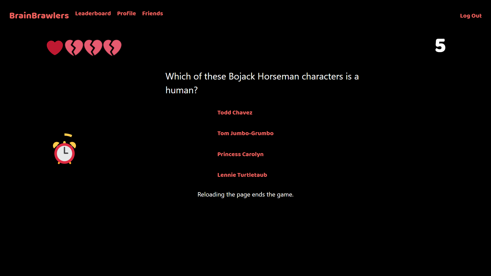

# ik19

## Brainbrawlers
Door: Sven van Mansom, Richard van den Aardweg en Friso Harlaar 

## Features:
 * Spelers kunnen registreren, inloggen en uitloggen met zowel client-side (javascript) als server-side validatie
 * Wachtwoord moet 6-20 karakters lang zijn, een nummer bevatten en geen spatie bevatten (dit wordt ook gecheckt)
 * Spelers kunnen kiezen uit twee gamemodes: _normal_ en _mirror_
 * De speler beantwoordt multiple choice of true/false trivia vragen
 * In mirror mode staan de vragen in spiegelbeeld (je leest van rechts naar links)
 * De speler heeft vier levens per spel
 * Per vraag is er een timer van 30 seconden
 * Per vraag krijgt de speler één punt
 * Per fout beantwoordde vraag gaat er één leven af
 * Bij elke tien vragen krijgt de speler een leven erbij (max 4 levens)
 * Moeilijkheidsgraad van de vragen gaat omhoog per tien vragen, vanaf vraag 20 is moeilijkheidsgraad maximaal
 * Per tien vragen gaan er vijf seconden van de timer af
 * Als de speler dood is krijgt hij een game over scherm of een nieuw record scherm met geanimeerd vuurwerk en toepasselijke geluidjes
 * De hoogste score van de speler wordt opgeslagen
 * Het spel werkt volledig in javascript, met kloppende hartjes en soepele page transitions
 * Leaderboard per gamemode waarin de 50 beste speler scores worden bijgehouden.
 * Spelers kunnen vrienden toevoegen en verwijderen
 * Apart leaderboard met scores van vrienden en de speler zelf
 * Profiel pagina met eigen highscore en rank
 * Speler kan zijn wachtwoord en gebruikersnaam veranderen, weer met client-side en server-side validatie.

## Rolverdeling
### Sven:

### Richard:
Vooral gewerkt aan de leaderboards, profile en Mirror mode. Ook ervoor gezorgd dat de gebruikers hun gebruikersnaam en wachtwoord kunnen veranderen.

### Friso:
Voornamelijk bezig geweest met javascript, autorisatie en gebruiksvriendelijkheid van de site. Ook het vrienden systeem toegevoegd.

## Wegwijzer
In ons helpers document hebben we de volgende functies:
 * login_required; Deze functie zorgt ervoor dat de gebruiker de bepaald route alleen kan doen als hij ingelogd is.
 * new_question; haalt een nieuwe vraag uit de API.
 * setup; na het beantwoorden van een vraag wordt in deze functie de nieuwe vraag (door new_question) op de goeie manier doorgegeven aan het spel.
 * get_db; helper functie waarmee SQL select commands worden uitgevoerd, zodat er geen SQL commands in application.py staan.
 * update_db; hetzelfde als bovenstaande functie maar dan voor update commands.
 * insdel_db; hetzelfde als voorgaande twee functies maar dan voor insert en delete commands.

Verder hebben wij een mapje templates, met daarin alle html templates. Hierin zijn ook weer drie mapjes te vinden: friends, game en auth (authorisation). Hierin staan de templates die bij die onderdelen horen.

Ook hebben wij een mapje static met daarin alle geluiden, afbeeldingen, css bestanden en externe javascript bestanden waarnaar verwijst wordt in de html bestanden.

Screenshots:  

