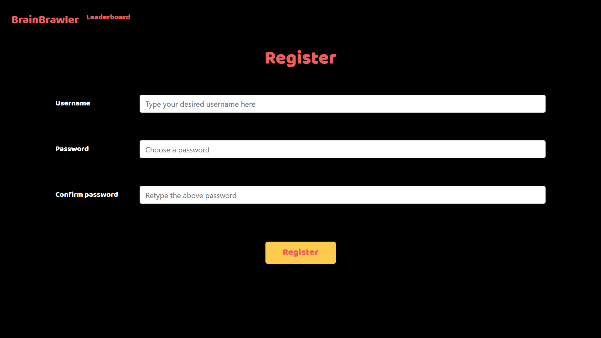
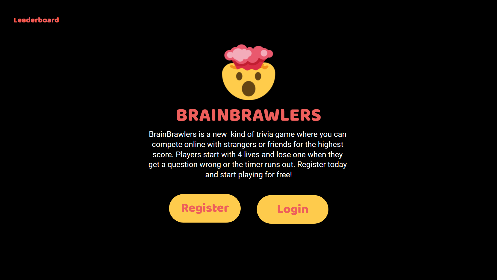
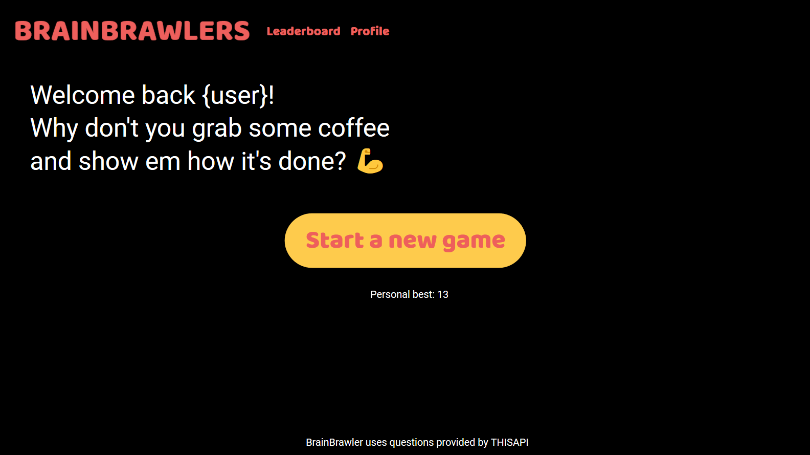
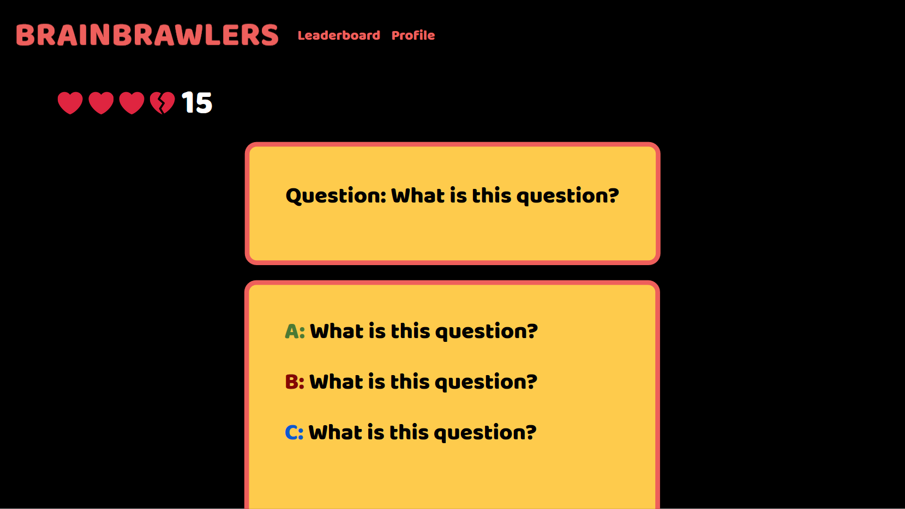
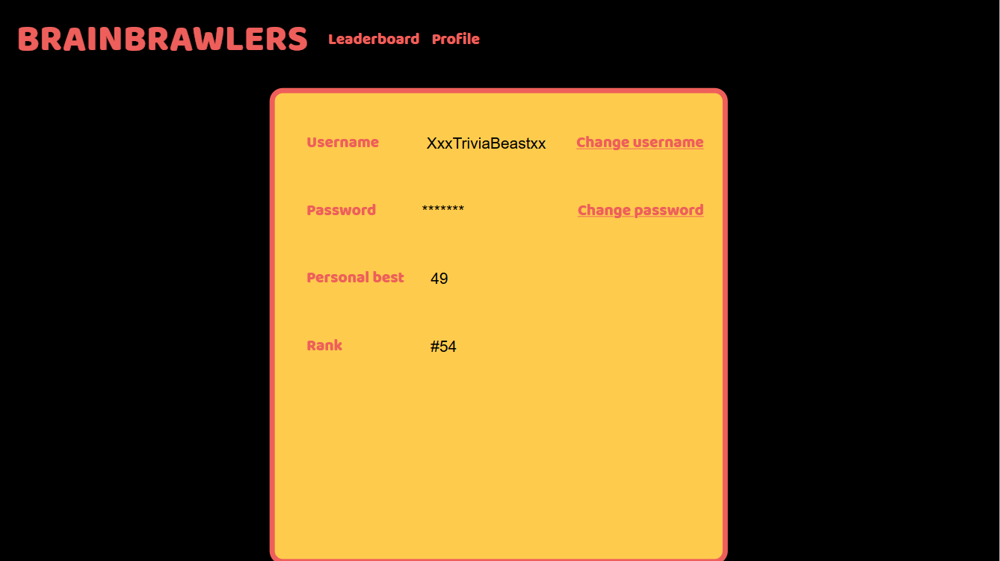

# ik19

Samenvatting  
Wij willen een spelletje creëren dat je kan spelen op een browser in de vorm van een trivia spel. Je moet kunnen inloggen zodat je  scores kan vergelijken met scores van andere spelers. De scores moeten opgeslagen worden in een database.  Elke speler begint  met vier levens die eraf gaan als je een vraag fout of niet binnen de tijd (30 seconden) beantwoordt. Elke vraag geeft één  punt, dus elk spel geeft minimaal 4 punten. Er zijn verschillende categorieën en moeilijkheidsgraden.

Features 
4 levens per speler 
Verschillende soorten levels op moeilijkheid (moeilijkere vragen en/of kortere tijd)
Leaderboard waarin de 50 hoogste scores bij worden gehouden.
Aantal categorieën op onderwerp
Timer in de vorm van een klok die veel aandacht trekt, zodat de gebruiker tijdsdruk ervaart.

Extra: 
Vriendschapsverzoeken om scores met vrienden te vergelijken
Directe versus modus waarbij de laatst overgebleven speler wint
Pop-up met percentage van hoeveel gebruikers die goed hadden geantwoord
Met Javascript geanimeerde error meldingen

Minimum viable product 
Kunnen registreren, inloggen, uitloggen en je eigen scores bekijken. Een leaderboard met high-scores van andere spelers. Per vraag een timer van 30(?) seconden, als de tijd om is voordat je de vraag hebt beantwoord of als de vraag fout is beantwoord, gaat er een leven van je af. Per vraag krijg je één punt, ongeacht of je de vraag goed of fout hebt, dus met vier levens heb je minimaal vier punten. Errors weergeven door door te verwijzen naar een error pagina, zoals apology in finance.

Afhankelijkheden (plugins)  
Databronnen: API https://opentdb.com/browse.php
Externe componenten: https://getbootstrap.com/ ~ Bootstrap
Concurrerende bestaande: https://www.funtrivia.com/quizzes/
Moeilijkste delen: het werken en animeren met Javascript

Routes 
register: (Met deze functie kan de gebruiker registreren) / → register → check (username and password) → index
login: (Met deze functie kan de gebruiker inloggen) / → login
logout: (Met deze functie kan de gebruiker uitloggen) clear session → /
start game: (Met deze functie kan de gebruiker een game starten) index → login required → games → choose category/level → start game
highscore board: (Met deze functie kan de gebruiker het highscore board zien) index → login required → highscores OR index(zie het op index)
index: (Met deze functie kan de gebruiker naar de home pagina) login → index
Apology: (Met deze functie kan de gebruiker een apology te zien, bijvoorbeeld na het fout invullen van een wachtwoord) MVP= HTML, anders ideaal=Javascript

Helpers 
In ons helpers document hebben we één functie genaamd login_required.
Deze functie zorgt ervoor dat de gebruiker de bepaald route alleen kan doen als hij ingelogd is.

https://drive.google.com/open?id=1i1CcKv4qYAudbn1Wy_uRDpWVmmscqeqm

